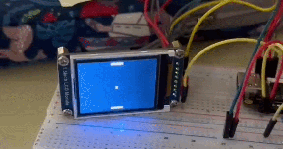

# FPGA Pong Game (Tang Nano 9K & ST7735 LCD)

A complete hardware implementation of the classic Pong arcade game written from scratch in Verilog HDL. The design runs on the **Sipeed Tang Nano 9K** (Gowin GW1NR-9 FPGA) and interfaces with a **1.8" ST7735 SPI TFT LCD** using an on-the-fly rendering architecture.

---



---

## Features

- **Hardware Rendering Pipeline:** Rendering directly to the SPI interface.
- **Hardware Button Debouncer:** digital debounce filtering for responsive input.
- **ST7735 Hardware Driver:** Custom state machine handling SPI, LCD initialization sequence, and streaming data.

---

## Hardware Architecture

The design is split into modular Verilog blocks:

- `top.v` - interconnecting submodules.
- `pong_engine.v` – Game state machine managing game physics and real-time pixel color determination.
- `st7735_driver.v` – SPI communication driver.
- `device_manager.v` – initialization FSM for the ST7735 TFT display.
- `button_debouncer.v` – debounce filtering for inputs.

---

## Hardware Utilization (Tang Nano 9K)

Synthesized using the Yosys and NextPNR:

| Resource | Used | Available | Utilization |
| :--- | :--- | :--- | :--- |
| **LUT4** | 1,068 | 8,640 | 12% |
| **ALU** | 712 | 6,480 | 10% |
| **DFF** | 213 | 6,480 | 3% |
| **BSRAM** | 0 | 26 | **0% (Zero Framebuffer Usage)** |
| **IOB** | 10 | 276 | 3% |

---

## Build & Flash

Using open-source toolchain (Yosys + NextPNR + OpenFPGALoader) via `Makefile`:

```bash
make
make flash
